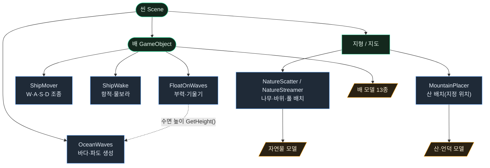

# 환경/아트 시스템 색인 (Environment & Art)

**바다·배·자연물·산** 등 우리가 추가한 환경/아트 시스템 안내입니다.
전투·교역·미션·월드맵·UI 등 게임 로직 전반은 기존 프로젝트 구조(루트 `CLAUDE.md`)를 따릅니다.

> 이 파일은 VS Code 마크다운 미리보기(Ctrl+Shift+V)에서 아래 다이어그램이 그림으로 보입니다.

---

## 한눈에 보는 구조



- **바다 계열:** `OceanWaves`(바다를 만들고 출렁임) ← `FloatOnWaves`가 수면 높이를 읽어 배를 띄움
- **배 계열:** 한 배에 `FloatOnWaves`(상하·기울기) + `ShipMover`(전후·회전) + `ShipWake`(거품)를 함께 부착 — 서로 충돌 없이 역할 분담
- **지형 계열:** 같은 지형 위에 `NatureScatter/Streamer`(자연물)와 `MountainPlacer`(산)가 각각 올라감

---

## 폴더 트리 (환경/아트 부분)

```
Assets/Game/
├─ Art/Models/                배·바다 FBX
│  ├─ <역사 범선 13종>.fbx
│  ├─ Ocean.fbx               바다 평면(정적; 움직임은 OceanWaves)
│  └─ Nature/                 자연물·산 FBX
│     ├─ Tree_*, Bush, Flower, Grass_Tuft, Stump
│     ├─ Rock, Rock_Small
│     └─ Mountain_Big, Mountain_Peak, Hill_Round
├─ Scripts/                   (환경 관련만 발췌)
│  ├─ OceanWaves.cs           바다·파도
│  ├─ FloatOnWaves.cs         배 부력
│  ├─ ShipMover.cs            배 조종
│  ├─ ShipWake.cs             배 항적
│  ├─ NatureScatter.cs        자연물 고정 배치
│  ├─ NatureStreamer.cs       자연물 스트리밍(큰 맵)
│  └─ MountainPlacer.cs       산 배치(지정 위치)
└─ Docs/                      가이드 문서(여기)
   ├─ README.md               ← 이 색인
   ├─ 바다_배_시스템_가이드.md
   ├─ 산_배치_가이드.md
   ├─ 자연물_배치_가이드.md
   └─ 자연물_밀도_조절_가이드.md
```

---

## 작업별 진입점 (어디부터 볼까?)

| 하고 싶은 것 | 스크립트 | 문서 |
|--------------|----------|------|
| 출렁이는 바다 깔기 | `OceanWaves` | 바다_배_시스템_가이드 |
| 배를 물에 띄우고 조종 | `FloatOnWaves`+`ShipMover`+`ShipWake` | 바다_배_시스템_가이드 |
| 나무·풀 깔기(작은 맵) | `NatureScatter` | 자연물_배치_가이드 |
| 나무·풀 깔기(큰 맵) | `NatureStreamer` | 자연물_밀도_조절_가이드 |
| 산 올리기 | 모델 직접 배치 / `MountainPlacer` | 산_배치_가이드 |

---

## 모델 목록

**배 (역사 범선 13종):** Dhow · Cog · Carrack · Galley · Junk · Fluyt · Caravel · SantaMaria · Galleon · Galleass · Panokseon · Geobukseon · Clipper
**자연물:** Tree_Pine · Tree_Round · Tree_Dead · Stump · Bush · Flower · Grass_Tuft · Rock · Rock_Small
**산·언덕:** Mountain_Big(눈) · Mountain_Peak(바위) · Hill_Round(언덕)

---

## ⚠ 기존 프로젝트와 겹칠 수 있는 시스템

아래 기존 스크립트는 우리가 만든 것과 **역할이 겹칠 수 있습니다.** 무엇을 쓸지 정리 권장:

- 바다: `SeaSimulation` · `SeaWorldManager`  ↔  `OceanWaves`
- 배: `ShipController` · `OarAnimator` · `ProceduralShipBuilder`  ↔  `ShipMover` · `FloatOnWaves`
- 지형/육지: `LandmassPlacer` · `LandPatchSpawner` · `M3WorldMeshBaker` · `WorldCarves`
- 카메라: `CameraFollow`
- NPC: `NpcSpawner`
